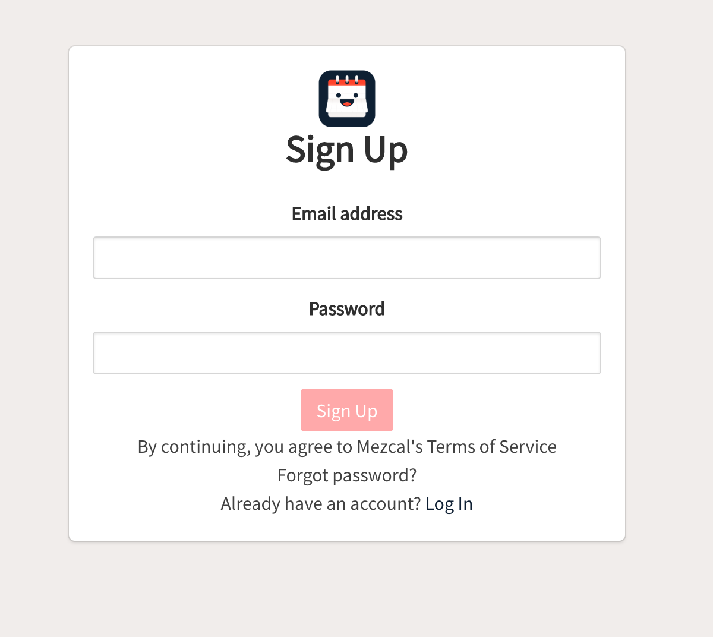
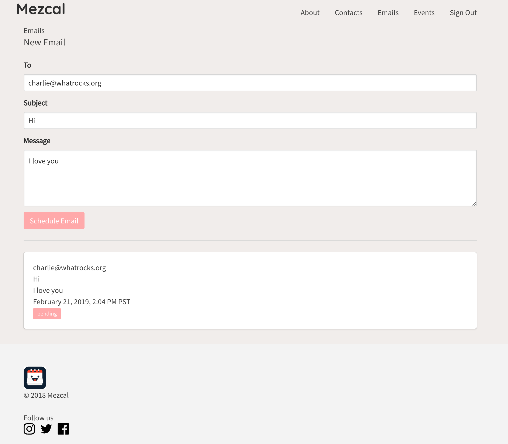

# mez-web

A web app to store your friends birthdays and schedule emails to be sent to them on their birthdays.

### Landing page


### Signup Page


### Schedule new email page


## local

run the app
```bash
yarn install
yarn start
```

The app should be running now on `http://localhost:3000/`

Make sure that the backend is running, too!

run tests
```bash
yarn test
```
